# ArtistTool.Workflows

AI-powered workflow services using Microsoft.Agents.AI for photo critique and analysis.

## Overview

This project provides workflow orchestration services that use AI agents to perform tasks like photo critiques. It uses the `Microsoft.Agents.AI.Workflows` framework to create composable, reusable AI workflows.

## Components

### Core Services

- **`AgentCache`** - Caches and manages AI agent instances
- **`AgentMarkdownParser`** - Parses agent definitions from markdown files
- **`CritiqueExecutor`** - Executes photo critique workflows
- **`WorkflowContext`** - Shared context for workflow execution

### Agent Configuration

Agents are defined in `Agents.md` using a simple markdown format:

```markdown
## Vision Photo Critique Agent

Instructions for the agent...

### Critique

Prompt text...
```

## Usage

### 1. Register Services

In your `Program.cs` or startup configuration:

```csharp
using ArtistTool.Workflows;

// Register workflow services
builder.Services.AddWorkflowServices();
```

### 2. Initialize Agents

After building the service provider, initialize agents from the markdown file:

```csharp
var app = builder.Build();

// Initialize agents from Agents.md
await app.Services.InitializeAgentsAsync();

// Or specify a custom path:
// await app.Services.InitializeAgentsAsync("path/to/custom-agents.md");
```

### 3. Use Workflow Executors

Inject and use the workflow executors in your services or controllers:

```csharp
public class PhotoService
{
    private readonly CritiqueExecutor _critiqueExecutor;
    private readonly IPhotoDatabase _photoDatabase;
    
    public PhotoService(
        CritiqueExecutor critiqueExecutor,
        IPhotoDatabase photoDatabase)
    {
        _critiqueExecutor = critiqueExecutor;
        _photoDatabase = photoDatabase;
    }
    
    public async Task<CritiqueResponse> CritiquePhotoAsync(string photoId)
    {
        var photo = await _photoDatabase.GetPhotographWithIdAsync(photoId);
        
        var context = new WorkflowContext
        {
            Photo = photo
        };
        
        // Execute the critique workflow
        var result = await _critiqueExecutor.HandleAsync(
            context, 
            workflowContext: null, // Or provide IWorkflowContext if available
            cancellationToken: CancellationToken.None);
        
        return result.Critique!;
    }
}
```

## Agent Types

The `AgentMarkdownParser` supports different agent types specified in the agent name:

- **`Conversational`** - Uses conversational AI (text-only)
- **`Vision`** - Uses vision AI (multimodal with image support)

Example:
```markdown
## Conversational Marketing Expert
## Vision Photo Critique Agent
```

## Workflow Context

The `WorkflowContext` class carries state through the workflow:

```csharp
public class WorkflowContext
{
    public Photograph? Photo { get; set; }
    public CritiqueResponse? Critique { get; set; }
    public bool RunningCritique { get; set; } = false;
}
```

## Critique Response

The AI returns structured critique data:

```csharp
public class CritiqueResponse
{
    public Critique[] Critiques { get; set; } = [];
}

public class Critique
{
    public string Area { get; set; } = string.Empty;        // e.g., "Composition", "Technique"
    public short Rating { get; set; }                       // 1-10 scale
    public string Praise { get; set; } = string.Empty;
    public string ImprovementSuggestion { get; set; } = string.Empty;
}
```

## Complete Example

```csharp
// In Program.cs
using ArtistTool.Workflows;

var builder = WebApplication.CreateBuilder(args);

// Add workflow services
builder.Services.AddWorkflowServices();

// Add other services...
builder.Services.AddIntelligenceServices(key => builder.Configuration[key] ?? string.Empty);

var app = builder.Build();

// Initialize agents
await app.Services.InitializeAgentsAsync();

app.Run();
```

```csharp
// In a Blazor component or service
@inject CritiqueExecutor CritiqueExecutor
@inject IPhotoDatabase Db

private async Task CritiqueCurrentPhoto()
{
    var context = new WorkflowContext
    {
        Photo = currentPhoto
    };
    
    var result = await CritiqueExecutor.HandleAsync(
        context, 
        null, 
        CancellationToken.None);
    
    // Display critique
    foreach (var critique in result.Critique.Critiques)
    {
        Console.WriteLine($"{critique.Area}: {critique.Rating}/10");
        Console.WriteLine($"Praise: {critique.Praise}");
        Console.WriteLine($"Suggestion: {critique.ImprovementSuggestion}");
    }
}
```

## Dependencies

- **Microsoft.Agents.AI** - Core agent framework
- **Microsoft.Agents.AI.Workflows** - Workflow orchestration
- **ArtistTool.Intelligence** - AI client providers
- **ArtistTool.Domain** - Domain models (Photograph, Category, etc.)

## Agent Configuration File

The `Agents.md` file must be copied to the output directory. This is configured in the `.csproj`:

```xml
<ItemGroup>
  <None Update="Agents.md">
    <CopyToOutputDirectory>Always</CopyToOutputDirectory>
  </None>
</ItemGroup>
```

## Extending with New Workflows

To create a new workflow executor:

1. Create a class that inherits from `ReflectingExecutor<T>` and implements `IMessageHandler<TIn, TOut>`
2. Register it in `Services.AddWorkflowServices()`
3. Define the agent in `Agents.md`

Example:

```csharp
public class MyCustomExecutor : ReflectingExecutor<MyCustomExecutor>,
    IMessageHandler<WorkflowContext, WorkflowContext>
{
    private readonly AgentCache _agents;
    
    public MyCustomExecutor(string id, AgentCache agents) : base(id)
    {
        _agents = agents;
    }
    
    public async ValueTask<WorkflowContext> HandleAsync(
        WorkflowContext message, 
        IWorkflowContext context, 
        CancellationToken cancellationToken = default)
    {
        // Your workflow logic here
        var agent = _agents["My Agent Name"];
        var chatClient = _agents.GetChatClient("My Agent Name");
        
        // Execute AI operations...
        
        return message;
    }
}
```

## Error Handling

The `AgentMarkdownParser` will throw exceptions for:

- Unsupported agent types
- Missing agent names
- Invalid markdown format

The `InitializeAgentsAsync` method will throw `FileNotFoundException` if the Agents.md file is not found.

## Best Practices

1. **Initialize Early**: Call `InitializeAgentsAsync()` during application startup
2. **Cache Agents**: Use the `AgentCache` to retrieve agents efficiently
3. **Structured Prompts**: Define clear, structured prompts in `Agents.md`
4. **Typed Responses**: Use structured response types with `GetResponseAsync<T>()`
5. **Error Handling**: Wrap workflow execution in try-catch blocks

## Troubleshooting

### "Agent not found in cache"
- Ensure `InitializeAgentsAsync()` was called before using executors
- Check that the agent name in code matches the name in `Agents.md`

### "Agents.md not found"
- Verify the file is set to "Copy to Output Directory"
- Check the path passed to `InitializeAgentsAsync()`

### "Agent type not supported"
- Only "Conversational" and "Vision" types are supported
- Check the agent type prefix in `Agents.md`

## Future Enhancements

- [ ] Support for image generation agents
- [ ] Workflow composition and chaining
- [ ] Async agent execution with progress callbacks
- [ ] Agent versioning and A/B testing
- [ ] Workflow telemetry and monitoring

```mermaid
  flowchart TD
  Start["Start (Start)"];
  MediumPreviewExecutor_Metal["MediumPreviewExecutor_Metal"];
  f6643a70-c7a8-4fa6-bb60-fade75c84a56["f6643a70-c7a8-4fa6-bb60-fade75c84a56"];
  bf2b7d94-697d-4cd1-8da9-71316ac141b8["bf2b7d94-697d-4cd1-8da9-71316ac141b8"];
  dfe09fde-1c1a-42da-8e87-2068f819a9e0["dfe09fde-1c1a-42da-8e87-2068f819a9e0"];
  7493511d-6438-4b5c-80d7-e2fd34454793["7493511d-6438-4b5c-80d7-e2fd34454793"];
  2aebb4f7-958b-43ad-b80e-6fffdd28024f["2aebb4f7-958b-43ad-b80e-6fffdd28024f"];
  491dc6ec-3de4-47fe-b80c-32993ba4b81a["491dc6ec-3de4-47fe-b80c-32993ba4b81a"];
  MediumPreviewExecutor_Canvas["MediumPreviewExecutor_Canvas"];
  8c53a97b-9ee1-449d-b041-b8e64f67f6c0["8c53a97b-9ee1-449d-b041-b8e64f67f6c0"];
  f41e5ec8-ea65-43b4-b90e-12ff047e3b87["f41e5ec8-ea65-43b4-b90e-12ff047e3b87"];
  cf36f388-8839-4956-af86-82fdf5ce1999["cf36f388-8839-4956-af86-82fdf5ce1999"];
  ca8b8866-00cc-485e-81a0-0e9e2ff8c467["ca8b8866-00cc-485e-81a0-0e9e2ff8c467"];
  ebdcd236-4b75-4401-918a-e25c85d07a32["ebdcd236-4b75-4401-918a-e25c85d07a32"];
  6411d4c8-a229-40d5-b8e7-ac131438a4ec["6411d4c8-a229-40d5-b8e7-ac131438a4ec"];
  MediumPreviewExecutor_Acrylic["MediumPreviewExecutor_Acrylic"];
  1794748b-179a-43df-88b7-b6e5e9970fbc["1794748b-179a-43df-88b7-b6e5e9970fbc"];
  4dfbf38a-be01-4d1f-942e-5b60dec82857["4dfbf38a-be01-4d1f-942e-5b60dec82857"];
  9e24db2c-abfe-47bf-b914-a91de2629cce["9e24db2c-abfe-47bf-b914-a91de2629cce"];
  c10cc065-c23d-4f6d-a7b4-03b2283d7f88["c10cc065-c23d-4f6d-a7b4-03b2283d7f88"];
  e26a0032-f912-4908-814a-ea5978c765b6["e26a0032-f912-4908-814a-ea5978c765b6"];
  82632bac-2050-47c1-8963-3f7f3c66177d["82632bac-2050-47c1-8963-3f7f3c66177d"];
  MediumPreviewExecutor_Framed_photo["MediumPreviewExecutor_Framed_photo"];
  bb562f14-a8a1-4513-964a-23160f3e91e2["bb562f14-a8a1-4513-964a-23160f3e91e2"];
  5bd6d17c-2c4a-4381-8584-5fe11b30fd61["5bd6d17c-2c4a-4381-8584-5fe11b30fd61"];
  a8ac2de2-db95-4d49-a2fa-6c1534bd7aee["a8ac2de2-db95-4d49-a2fa-6c1534bd7aee"];
  d0fd33cb-842f-45c8-bd94-64b5fde401ca["d0fd33cb-842f-45c8-bd94-64b5fde401ca"];
  131f2f8e-f450-4afe-8b59-0470b18b948f["131f2f8e-f450-4afe-8b59-0470b18b948f"];
  ad627af3-5b5e-49b5-aded-38e17f11d792["ad627af3-5b5e-49b5-aded-38e17f11d792"];
  ChatMessageExecutor["ChatMessageExecutor"];
  AggregatingExecutor["AggregatingExecutor"];
 
  fan_in_491dc6ec-3de4-47fe-b80c-32993ba4b81a_72FC3010((fan-in))
  fan_in_6411d4c8-a229-40d5-b8e7-ac131438a4ec_4D44A8F7((fan-in))
  fan_in_82632bac-2050-47c1-8963-3f7f3c66177d_F88DEEB9((fan-in))
  fan_in_ad627af3-5b5e-49b5-aded-38e17f11d792_393946F7((fan-in))
  fan_in_AggregatingExecutor_C8B4D845((fan-in))
  2aebb4f7-958b-43ad-b80e-6fffdd28024f --> fan_in_491dc6ec-3de4-47fe-b80c-32993ba4b81a_72FC3010;
  7493511d-6438-4b5c-80d7-e2fd34454793 --> fan_in_491dc6ec-3de4-47fe-b80c-32993ba4b81a_72FC3010;
  bf2b7d94-697d-4cd1-8da9-71316ac141b8 --> fan_in_491dc6ec-3de4-47fe-b80c-32993ba4b81a_72FC3010;
  fan_in_491dc6ec-3de4-47fe-b80c-32993ba4b81a_72FC3010 --> 491dc6ec-3de4-47fe-b80c-32993ba4b81a;
  ca8b8866-00cc-485e-81a0-0e9e2ff8c467 --> fan_in_6411d4c8-a229-40d5-b8e7-ac131438a4ec_4D44A8F7;
  ebdcd236-4b75-4401-918a-e25c85d07a32 --> fan_in_6411d4c8-a229-40d5-b8e7-ac131438a4ec_4D44A8F7;
  f41e5ec8-ea65-43b4-b90e-12ff047e3b87 --> fan_in_6411d4c8-a229-40d5-b8e7-ac131438a4ec_4D44A8F7;
  fan_in_6411d4c8-a229-40d5-b8e7-ac131438a4ec_4D44A8F7 --> 6411d4c8-a229-40d5-b8e7-ac131438a4ec;
  4dfbf38a-be01-4d1f-942e-5b60dec82857 --> fan_in_82632bac-2050-47c1-8963-3f7f3c66177d_F88DEEB9;
  c10cc065-c23d-4f6d-a7b4-03b2283d7f88 --> fan_in_82632bac-2050-47c1-8963-3f7f3c66177d_F88DEEB9;
  e26a0032-f912-4908-814a-ea5978c765b6 --> fan_in_82632bac-2050-47c1-8963-3f7f3c66177d_F88DEEB9;
  fan_in_82632bac-2050-47c1-8963-3f7f3c66177d_F88DEEB9 --> 82632bac-2050-47c1-8963-3f7f3c66177d;
  131f2f8e-f450-4afe-8b59-0470b18b948f --> fan_in_ad627af3-5b5e-49b5-aded-38e17f11d792_393946F7;
  5bd6d17c-2c4a-4381-8584-5fe11b30fd61 --> fan_in_ad627af3-5b5e-49b5-aded-38e17f11d792_393946F7;
  d0fd33cb-842f-45c8-bd94-64b5fde401ca --> fan_in_ad627af3-5b5e-49b5-aded-38e17f11d792_393946F7;
  fan_in_ad627af3-5b5e-49b5-aded-38e17f11d792_393946F7 --> ad627af3-5b5e-49b5-aded-38e17f11d792;
  491dc6ec-3de4-47fe-b80c-32993ba4b81a --> fan_in_AggregatingExecutor_C8B4D845;
  6411d4c8-a229-40d5-b8e7-ac131438a4ec --> fan_in_AggregatingExecutor_C8B4D845;
  82632bac-2050-47c1-8963-3f7f3c66177d --> fan_in_AggregatingExecutor_C8B4D845;
  ChatMessageExecutor --> fan_in_AggregatingExecutor_C8B4D845;
  ad627af3-5b5e-49b5-aded-38e17f11d792 --> fan_in_AggregatingExecutor_C8B4D845;
  fan_in_AggregatingExecutor_C8B4D845 --> AggregatingExecutor;
  f6643a70-c7a8-4fa6-bb60-fade75c84a56 --> bf2b7d94-697d-4cd1-8da9-71316ac141b8;
  dfe09fde-1c1a-42da-8e87-2068f819a9e0 --> 7493511d-6438-4b5c-80d7-e2fd34454793;
  MediumPreviewExecutor_Metal --> f6643a70-c7a8-4fa6-bb60-fade75c84a56;
  MediumPreviewExecutor_Metal --> dfe09fde-1c1a-42da-8e87-2068f819a9e0;
  MediumPreviewExecutor_Metal --> 2aebb4f7-958b-43ad-b80e-6fffdd28024f;
  8c53a97b-9ee1-449d-b041-b8e64f67f6c0 --> f41e5ec8-ea65-43b4-b90e-12ff047e3b87;
  cf36f388-8839-4956-af86-82fdf5ce1999 --> ca8b8866-00cc-485e-81a0-0e9e2ff8c467;
  MediumPreviewExecutor_Canvas --> 8c53a97b-9ee1-449d-b041-b8e64f67f6c0;
  MediumPreviewExecutor_Canvas --> cf36f388-8839-4956-af86-82fdf5ce1999;
  MediumPreviewExecutor_Canvas --> ebdcd236-4b75-4401-918a-e25c85d07a32;
  1794748b-179a-43df-88b7-b6e5e9970fbc --> 4dfbf38a-be01-4d1f-942e-5b60dec82857;
  9e24db2c-abfe-47bf-b914-a91de2629cce --> c10cc065-c23d-4f6d-a7b4-03b2283d7f88;
  MediumPreviewExecutor_Acrylic --> 1794748b-179a-43df-88b7-b6e5e9970fbc;
  MediumPreviewExecutor_Acrylic --> 9e24db2c-abfe-47bf-b914-a91de2629cce;
  MediumPreviewExecutor_Acrylic --> e26a0032-f912-4908-814a-ea5978c765b6;
  bb562f14-a8a1-4513-964a-23160f3e91e2 --> 5bd6d17c-2c4a-4381-8584-5fe11b30fd61;
  a8ac2de2-db95-4d49-a2fa-6c1534bd7aee --> d0fd33cb-842f-45c8-bd94-64b5fde401ca;
  MediumPreviewExecutor_Framed_photo --> bb562f14-a8a1-4513-964a-23160f3e91e2;
  MediumPreviewExecutor_Framed_photo --> a8ac2de2-db95-4d49-a2fa-6c1534bd7aee;
  MediumPreviewExecutor_Framed_photo --> 131f2f8e-f450-4afe-8b59-0470b18b948f;
  Start --> ChatMessageExecutor;
  Start --> MediumPreviewExecutor_Metal;
  Start --> MediumPreviewExecutor_Canvas;
  Start --> MediumPreviewExecutor_Acrylic;
  Start --> MediumPreviewExecutor_Framed_photo;
```

     

      